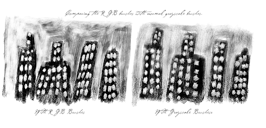
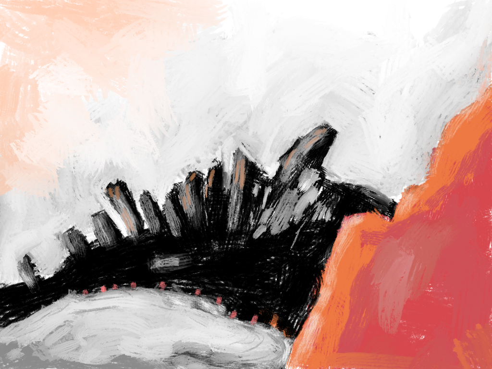

# BRUSHES FOR GIMP 2.10 AND RESOURCES

## Comparing RGB versus Grayscale brush
The comparison was made using the same brush in RGB and Grayscale version.
I have applied, also, the Unsharp Mask filter along the two images (the bottom strip).
Is possible to see that the RGB brush is more 'sharper' (left-side image) and the Unsharp Mask the effect is a bit sharper and better defined than the image made with grayscale brush version (right-side image).
> 
> RGB to test the concept of quality of transparencies, By Jag.
> See also: https://plus.google.com/u/0/+AmericoGobbo/posts/9YvYwbBwhBt

** Archive: method-workshop-brush.png **
> Image using RGB brush together Color parameter of the paint dynamics.

** Archive: method-workshop.gih **
